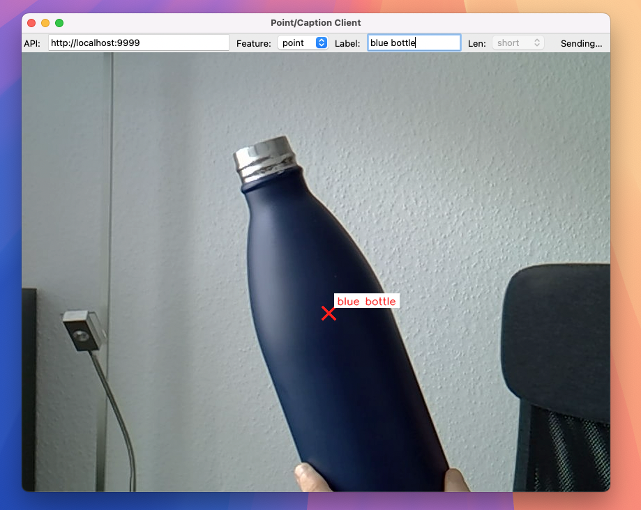
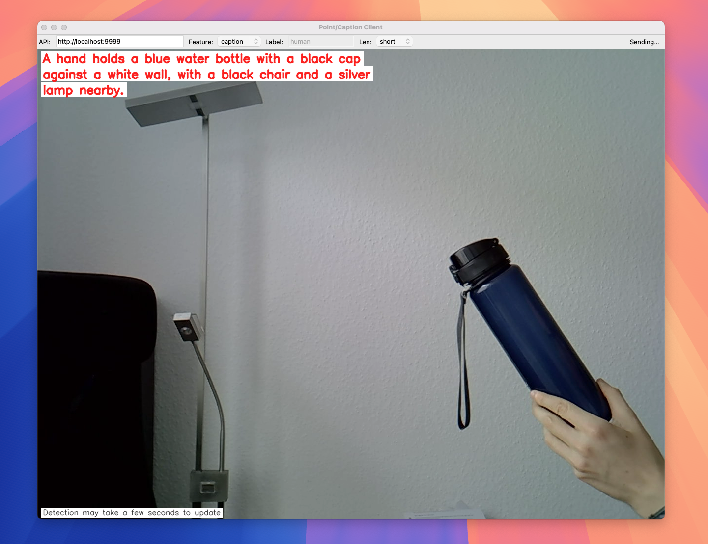

# vlm-playground

My playground for vision language models (VLM), powered by [vikhyatk/moondream2](https://huggingface.co/vikhyatk/moondream2)

## Getting started

- `uv run src/main.py`
- Use endpoint directly or pre-configured demo `live object detection` app in /demo_apps

## API Endpoints

- GET /health  
  Returns API health status.  
  Response: {"status": "ok"}

- POST /caption  
  Generate a caption for an uploaded image.  
  Params:  
    - file: image file (JPEG/PNG)  
    - length: "short" | "normal"  
  Response: {"caption": "..."}

- POST /caption/stream  
  Stream caption tokens for an uploaded image.  
  Response: text stream (text/plain)

- POST /query  
  Answer a question about an uploaded image.  
  Params:  
    - file: image file  
    - question: string  
  Response: {"answer": "..."}

- POST /query/stream  
  Stream answer tokens for an image-based question.  
  Response: text stream (text/plain)

- POST /detect  
  Detect objects of a given label in an image.  
  Params:  
    - file: image file  
    - label: string  
  Response: {"objects": [{"x1":..,"y1":..,"x2":..,"y2":..}, ...]}

- POST /point  
  Locate specific points for a label in an image.  
  Params:  
    - file: image file  
    - label: string  
  Response: {"points": [{"x":..,"y":..}, ...]}

# Demo apps

## Live object detection

This desktop app opens your camera, continuously streams the latest frame to a configured API endpoint (/point), and overlays the points returned by the server directly on the live video feed.

- Label configurable in the UI – choose what object the server should detect (e.g., "person").
- Non-blocking requests – always sends only one frame at a time, using the most recent image when ready.
- Live overlay – displays red “X” markers and labels where the server detected objects, even if they’ve already moved in the live view.
- Cross-platform – runs as a simple Python/Tkinter application with OpenCV.

This is simple app to demonstrate real-time object/point detection using the vision API backend. Make sure your API is running in the background.

### Examples

Finding one or more objects in a frame

Creating an image caption

